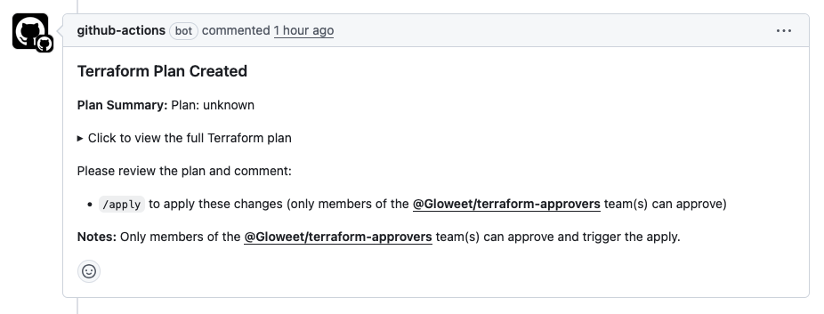
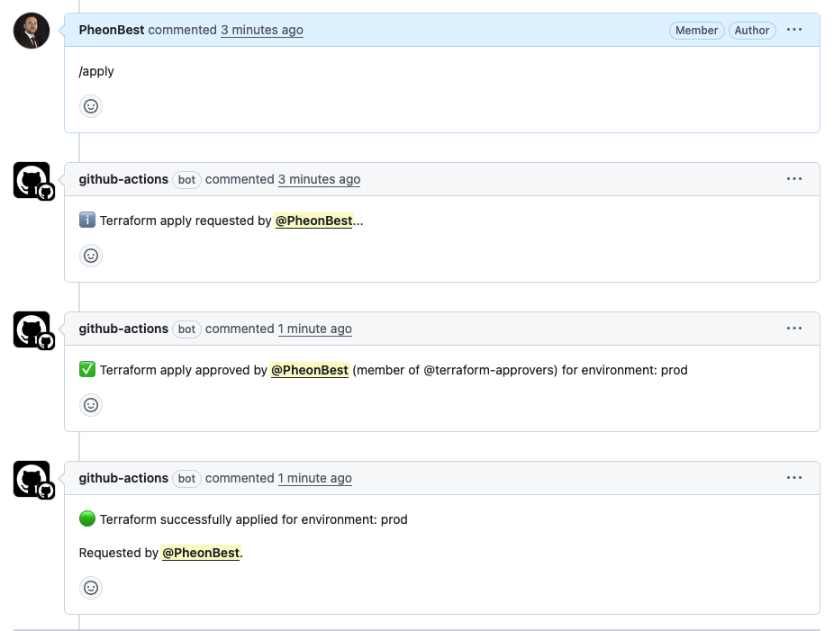

# Launchplate React

A React application deployed to AWS using Terraform with multiple environment support.

- **Frontend**: React **static** **SPA** hosted on S3 and distributed via CloudFront
- **DNS**: Managed by either **CloudFlare** or **Route53** (environment-dependent)
- **Optional Features**: S3 buckets encryption (disabled by default), WAF protection (disabled by default)
- **SSL Certificates**: AWS ACM with DNS validation
- **Redirect from root to www**: Enabled by default when using Cloudflare, based on Page Rules. This feature isn't supported when using Route53.

```
├── .github/
│   ├── actions/          # Custom GitHub Actions
│   └── workflows/        # GitHub Actions workflows
├── terraform/
│   ├── live              # Workspace-CLI environments
│   ├── modules/          # Reusable Terraform modules
│   └── bootstrap/        # Bootstrap shared TF state
└── web/                      # React application source code
```

Make a table with three rows (production, staging, development) with two columns (root url redirected to www, www url)

| Environment | Root URL (redirected to www) | WWW URL |
|-------------|---------------------------|---------|
| Production  | [launchplate-react.gloweet.com](https://launchplate-react.gloweet.com)                       | [www.launchplate-react.gloweet.com](https://www.launchplate-react.gloweet.com) |
| Staging     | [stg-launchplate-react.gloweet.com](https://stg-launchplate-react.gloweet.com)                       | [www.stg-launchplate-react.gloweet.com](https://www.stg-launchplate-react.gloweet.com) |
| Development | [dev-launchplate-react.gloweet.com](https://dev-launchplate-react.gloweet.com)                       | [www.dev-launchplate-react.gloweet.com](https://www.dev-launchplate-react.gloweet.com) |

## Documentation
- [Infrastructure and CI/CD pipeline setup](/terraform/README.md)
- [Use pre-commit](/docs/pre-commit.md)

## Development Setup

1. **Prerequisites**

   - Node.js 20+
   - pnpm 10+
   - AWS CLI configured
   - Terraform CLI 1.12+

2. **Install dependencies**

   ```bash
   pnpm install
   ```

3. **Run locally**

   ```bash
   pnpm dev
   ```

4. **Run tests**

   ```bash
   pnpm test
   ```

5. **Build for specific environment**
   ```bash
   pnpm build:qa      # Build for QA
   pnpm build:staging # Build for Staging
   pnpm build:production  # Build for Production
   ```

## Infrastructure Management

### Working with Terraform Workspaces

This project uses Terraform Workspaces to manage multiple environments (qa, staging, production).

```bash
cd terraform/live
# Initialize Terraform
terraform init

# Initialize Workspaces
terraform workspace new dev
terraform workspace new stg
terraform workspace new prod
terraform workspace list

terraform workspace select dev

# Plan changes
terraform plan

# Apply changes
terraform apply
```

### Pushing website to S3

To push the build website to S3, run the following command:

```bash
cd web
pnpm build:prod
pnpm aws:sync:prod
```

### How to use the CI/CD Workflow

By safety, infrastructure deployment never runs automatically.
It requires manual approval:
- On **pull request**, the workflow creates a GitHub issue with the Terraform plan. When answering `/apply`, only members of the `terraform-approvers` team can approve.
- On **workflow_dispatch** with the **"Auto Apply"** option enabled, the workflow will automatically apply the changes without requiring manual approval.

#### **Automatic Deployment**

On push, the workflow will automatically:
1. Build the application using the target environment configuration.
2. Generate a terraform plan.

If the web application files were updated, the S3 buckets are automatically synced and the CloudFront cache is invalidated.
The matching between branch names and target environment is like so:
| Source Branch | Target Environment |
|---------------|--------------------|
| main          | prod               |
| staging       | stg                |
| development   | dev                |

#### **Pull Request Flow**

For PRs:
1. The workflow runs and comments the plan on the PR
2. Review the plan in the PR comments
   
3. Comment `/apply` to approve

   Only members of allowed organization teams can approve.

   Please note that the repository must be owned by an organization.

   

This implementation addresses both issues you identified while maintaining a clean, understandable workflow structure.

#### **Workflow Diagram**
In case there's a terraform change, the job `s3_sync` runs after `tf_apply`.

